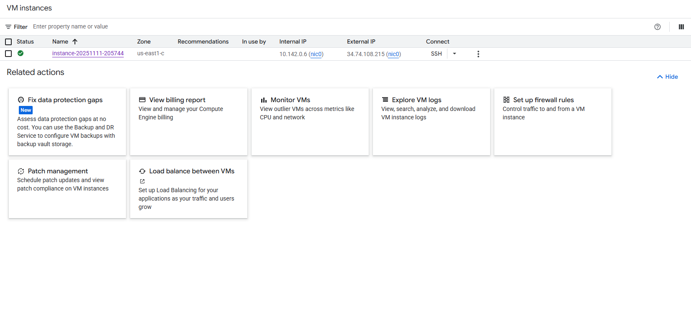
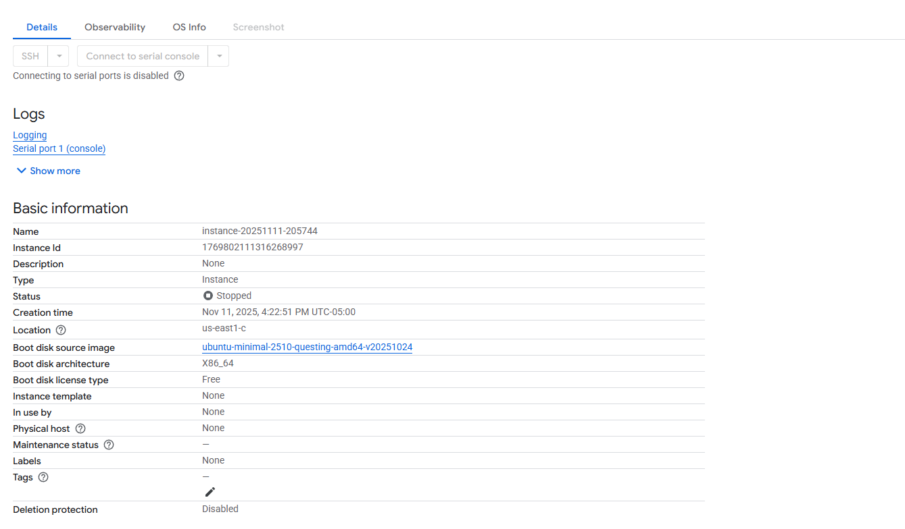
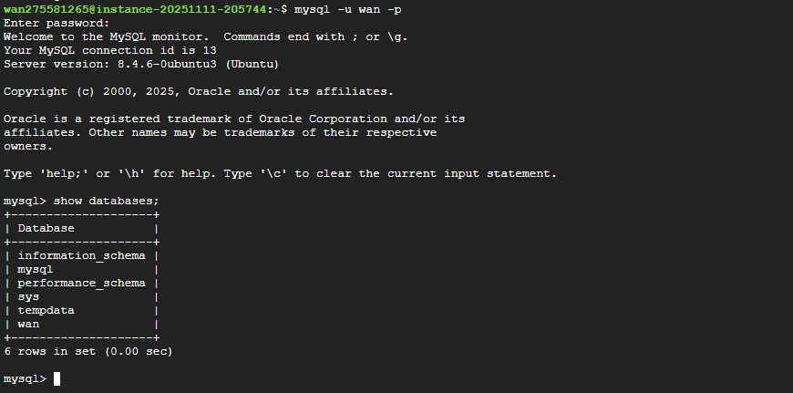
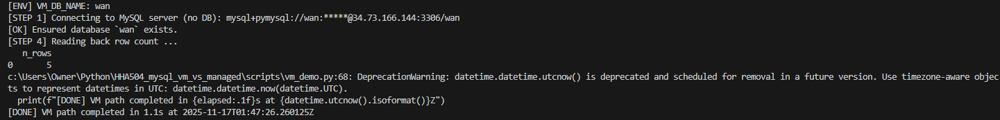
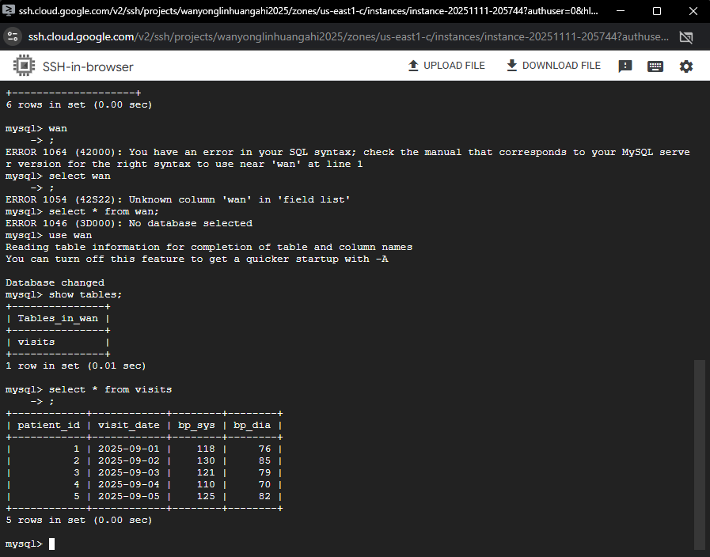
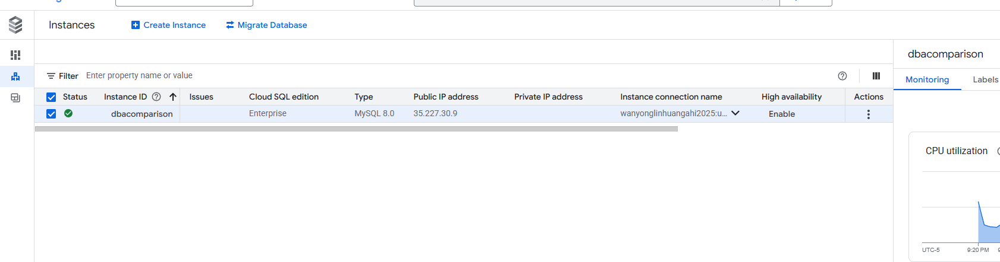
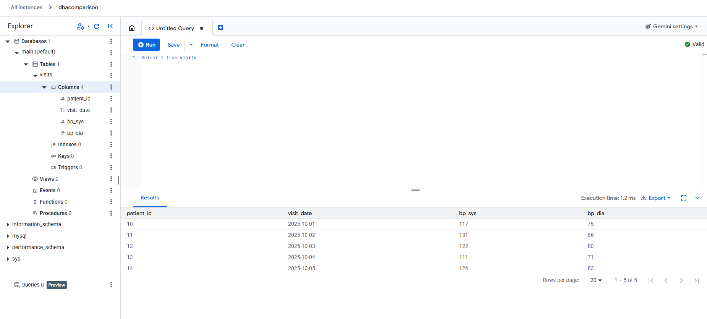

# MySQL comparison between VM(self-managed) and Managed

## Recording
Loom recording <https://www.loom.com/share/81188c8ec7574e6eb1ec944c5deea38b>

## Chosen platform
I decided to use google cloud platform to create the virtual machine and the cloud SQL database.

## VM
### VM creation
1. Select instance to create.
2. Choose E2 for price and usability.
3. Choose e2-small for 2GB of memory.
4. Choose Ubuntu OS system.
5. Everything else kept to default.

### Firewall configuration
1. Create a firewall rule.
2. Name it and give it a description.
3. Set IP range to 0.0.0.0/0 to allow all IPs.
4. Set protocol to tcp:3306

### SSH steps
1. Input `sudo apt-get update` to update the OS system.
2. Input `sudo apt install mysql-server mysql-client` to install mysql into the server.
3. Input `sudo mysql` to log in into mysql.
4. Input `CREATE USER 'xxx'@'%' IDENTIFIED BY 'xxx';` to add user to database
5. Input `GRANT ALL PRIVILEGES ON *.* TO 'xxx'@'%' WITH GRANT OPTION;` to give all privileges to the user.
6. Edit mysqld.cnf file and input `0.0.0.0/0` to allow for other network connections.
7. Researt SSH and input `mysql -u dba -p` to locally test the user connection to mysql.
8. Input the password you set to the username.

Secrets can be stored in an .env file

## Managed Cloud SQL
### Cloud SQL
1. Select to create a sandbox MySQL instance.
2. Name instance and set a password.
3. Select a region press create.

### Configuration
1. Add `0.0.0.0/0` to authorized networks.
2. Disable SSL only connection for security.
3. Add a new user with a username and set a password for it.

Secrets can be stored in an .env file

## Screenshots
### VM
Running VM

VM configuration

SSH connection to MySQL

Python script results

VM query

### Managed
Running MN cloud SQL

Python script results

MN cloud SQL query
